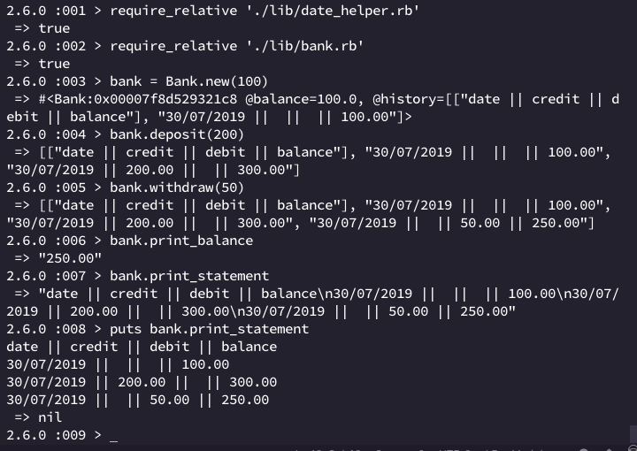

# Bank tech test

Bank is a small command line app that lets you deposit and withdraw currency and keep track of your transactions for as long as your Terminal session lives. Terminating the session erases all your financial information - it's fully secure! Untraceable! Tax free!

Bank is a Makers Academy Week 10 tech test.

## How to use

1. Clone/download this repo
2. Open irb and require the `bank.rb` file, like so:

```
> irb
> require_relative './lib/bank.rb'
 => true 
```

3. To start your command line bank, run `Bank.new(sum)` in your terminal, replacing the sum with your starting balance; otherwise it will default to 0
4. To make a deposit, use `bank.deposit(sum)`
5. To withdraw money, use `bank.withdraw(sum)`
6. To view your full dated statement, run `bank.account_statement`
7. You can also view your balance alone with `bank.account_balance`

**See it in action!**




### To run tests

1. In the project directory, run `bundle install`
2. Run `rspec` - should also display test coverage
3. To run linting: run `rubocop`

## Functionality

- REPL app but no need for a command line interface
- bank takes deposits
- bank withdraws money
- bank prints account statements with date, amount, balance on it
- no need for a database but should keep data in memory

## Acceptance criteria

**Given** a client makes a deposit of 1000 on 10-01-2012  
**And** a deposit of 2000 on 13-01-2012  
**And** a withdrawal of 500 on 14-01-2012  
**When** she prints her bank statement  
**Then** she would see

```
date || credit || debit || balance
14/01/2012 || || 500.00 || 2500.00
13/01/2012 || 2000.00 || || 3000.00
10/01/2012 || 1000.00 || || 1000.00
```


### Initial approach:

* Bank - single class  
* Basic functionality - Bank is launched in an empty state, prints out an empty dated statement  
* Creating a Date helper to use in both tests and code  
* Test for the date helper  
* Statement method - returns from other methods: adds header, history formatted  
* Expanded test coverage into both unit and feature tests
* simple methods first going by the scenario from spec: deposit, withdrawal  
* added private methods to format and return numbers with trailing zeroes   
* Refactor: in accordance with OO principles I broke down the Bank class into single-purpose subclasses; I also removed the method that formatted the sums and replaced it with string interpolation
