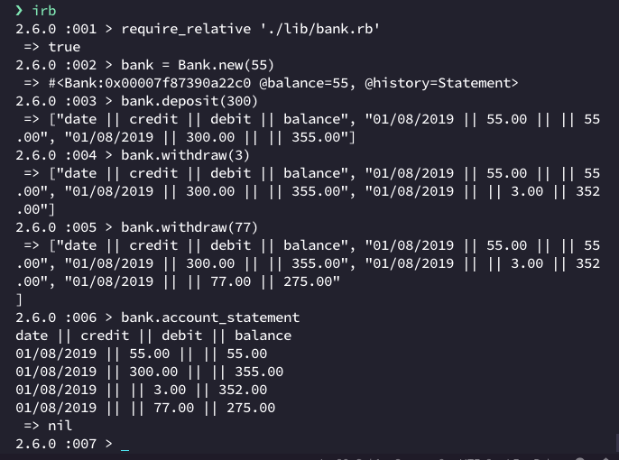

# Bank tech test

## How to use

1. clone/download this repo
2. go to the `lib/bank.rb` file and comment out the top line (you'll need to uncomment it to run the tests)
3. open irb, requiring both the `date_helper.rb` and the `bank.rb` file, like so:

```
$ irb
$ require_relative './lib/date_helper.rb'
 => true 
$ require_relative './lib/bank.rb'
 => true 
```

4. to open a new bank, run `Bank.new(sum)` in your terminal, replacing the sum with your starting balance; otherwise it will default to 0
5. To make a deposit, use `bank.deposit(sum)`
6. To withdraw, use `bank.withdraw(sum)`
7. To view your full dated statement, run `bank.print_statement`
8. You can also view your balance alone with `bank.print_balance`

**See it in action!**




### To run tests

1. in the project directory, run `bundle install`
2. run `rspec` - should also display test coverage
3. To run linting: run `rubocop`
4. in case of an error, make sure the top line in `bank.rb` is not commented out


## Functionality

- REPL app but no need for a command line interface
- bank takes deposits
- bank withdraws money
- bank prints account statements with date, amount, balance on it
- no need for a database but should keep data in memory

## Acceptance criteria

**Given** a client makes a deposit of 1000 on 10-01-2012  
**And** a deposit of 2000 on 13-01-2012  
**And** a withdrawal of 500 on 14-01-2012  
**When** she prints her bank statement  
**Then** she would see

```
date || credit || debit || balance
14/01/2012 || || 500.00 || 2500.00
13/01/2012 || 2000.00 || || 3000.00
10/01/2012 || 1000.00 || || 1000.00
```


### Initial approach:

Bank - single class  
Basic functionality - Bank is launched in an empty state, prints out an empty dated statement  
Creating a Date helper to use in both tests and code  
Test for the date helper  
Statement method - returns from other methods: adds header, history formatted  
simple methods first going by the scenario from spec: deposit, withdrawal  
added private methods to format and return numbers with trailing zeroes  
